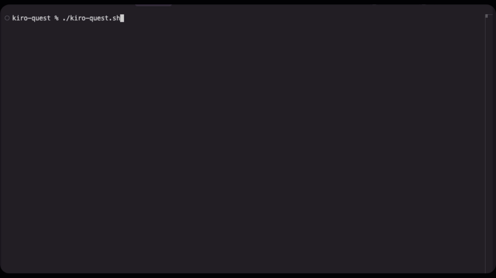

# 🚀 Kiro Quest

A gamified introduction to Kiro - your AI-powered development companion! Complete quests, earn badges, and level up while learning all of Kiro's powerful features. Now with enhanced analytics, streak tracking, achievements, and intelligent guidance!

## 🎬 Demo

<!-- Add your demo GIF or video here -->

*Experience the enhanced gamified onboarding journey*

## 🎮 What is Kiro Quest?

Kiro Quest is an interactive onboarding experience that transforms learning Kiro into an engaging adventure. Instead of reading boring documentation, you'll complete hands-on quests that teach you everything from basic chat features to advanced automation.

### 🆕 What's New
- **Smart Progress Tracking** - Detailed analytics and completion metrics
- **Streak System** - Daily engagement tracking with fire emoji chains  
- **Enhanced Achievement System** - Comprehensive badges and milestones
- **Interactive Guidance** - Context-aware help and suggestions
- **Accessibility Options** - Colorblind-friendly and high-contrast modes
- **Backward Compatibility** - Seamless upgrade from v1.0 with data preservation
- **Feature Flags** - Customizable experience with enhanced/legacy modes

## ✨ Enhanced Features

### Core Experience
- **9 Progressive Quests** - From beginner to expert level with enhanced interactivity
- **Enhanced Badge System** - Earn unique badges with detailed achievement tracking
- **Smart Level Progression** - Gain points and level up with analytics-driven insights
- **Visual Progress Tracking** - Enhanced progress bars, streak indicators, and completion stats
- **Persistent Progress** - Your achievements are saved with detailed analytics
- **Built-in Reset Option** - Safely clear all progress when needed

### Enhanced v2.0 Features
- **Streak Tracking** - Daily engagement with fire emoji chains and milestone rewards
- **Achievement System** - Comprehensive badges, milestones, and special achievements
- **Smart Recommendations** - Personalized quest suggestions based on your progress
- **Interactive Tutorials** - Step-by-step guided learning with validation checkpoints
- **Context-Aware Help** - Intelligent assistance when you're stuck
- **Accessibility Options** - Colorblind-friendly colors and high-contrast modes
- **Analytics Dashboard** - Track your learning progress and feature usage
- **Feature Flags** - Customize your experience (enhanced/legacy/tutorial modes)

## 🏆 Quest Overview

| Quest | Difficulty | Badge | Points | What You'll Learn |
|-------|------------|-------|--------|-------------------|
| 1. Explore Interface | Beginner | 🗺️ Explorer | 50 | Navigate Kiro's UI and panels |
| 2. Master Chat | Beginner | 💬 Chat Master | 75 | Use context features like #File, #Problems |
| 3. File Context Magic | Intermediate | 📁 File Wizard | 100 | Reference files and folders in chat |
| 4. Autopilot Mode | Intermediate | 🚁 Autopilot Ace | 125 | Let Kiro modify files autonomously |
| 5. Create Specs | Advanced | 📋 Spec Architect | 150 | Plan features with structured specs |
| 6. Agent Hooks | Advanced | 🎣 Hook Hero | 175 | Automate workflows with event triggers |
| 7. MCP Tools | Expert | 🔌 MCP Pioneer | 200 | Extend Kiro with external tools |
| 8. Steering Files | Expert | 🎯 Steering Captain | 225 | Customize Kiro's behavior |
| 9. Code Assistance | Expert | ⚡ Code Commander | 250 | Master advanced coding features |
| **Complete All** | Champion | 🏆 Quest Champion | 500 | Become a certified Kiro master! |

## 🚀 Getting Started

### Prerequisites

- **jq** - JSON processor for progress tracking (auto-installed on most systems)
  ```bash
  # macOS
  brew install jq
  
  # Ubuntu/Debian
  sudo apt install jq
  
  # Other systems: https://jqlang.github.io/jq/download/
  ```
- **Kiro IDE** - For full integration features (optional for standalone mode)
- **Bash 4.0+** - Most modern systems include this

### Installation & Usage

1. **Download the enhanced quest script:**
   ```bash
   curl -O https://raw.githubusercontent.com/your-repo/kiro-quest.sh
   chmod +x kiro-quest.sh
   ```

2. **Start your enhanced adventure:**
   ```bash
   ./kiro-quest.sh
   ```
   **💡 For the best experience, run from within Kiro IDE terminal for full integration**

3. **First-time setup:**
   - New users get the full enhanced experience
   - Upgrading from v1.0? Your progress is automatically migrated!
   - Choose your preferred mode (enhanced/legacy/tutorial)

4. **Follow the interactive menu** to choose and complete quests!

## 🎯 How It Works

### Enhanced Progress Tracking
Your progress is saved with detailed analytics:

**Legacy format** (maintained for compatibility):
```json
{
  "completed_quests": ["explorer", "chat_master"],
  "total_score": 125,
  "level": 2
}
```

**Enhanced format** (v2.0 features):
```json
{
  "version": "2.0",
  "profile": {
    "preferred_learning_style": "guided",
    "total_sessions": 15
  },
  "progress": {
    "current_streak": 7,
    "longest_streak": 12,
    "total_time_spent": 3600
  },
  "achievements": {
    "badges": ["explorer", "chat_master"],
    "milestones": ["first_week", "streak_master"]
  }
}
```

### Enhanced Features

**Badge Collection**: Stored in `~/.kiro/quest-badges/` with detailed achievement data

**Streak Tracking**: Daily engagement with fire emoji chains and milestone rewards

**Smart Recommendations**: Personalized quest suggestions based on your learning style

**Interactive Guidance**: Context-aware help when you're stuck on quests

**Accessibility**: Colorblind-friendly colors and high-contrast display options

### Quest Experience
Each enhanced quest provides:
- Clear mission objectives with interactive guidance
- Pro tips (including "👻 If unsure, ask Kiro!")
- Example tasks with validation checkpoints
- Progress tracking and completion analytics
- Context-aware help and suggestions

### Menu Options
- **0-9**: Select and complete quests (with enhanced guidance)
- **0**: View your earned badge collection and achievements
- **s**: View streak information and engagement stats
- **h**: Access help and tutorial mode
- **a**: Toggle accessibility options
- **r**: Reset all progress (requires typing "RESET" to confirm)
- **q**: Quit the quest application

## 💡 Pro Tips

### Learning Strategy
- **👻 If unsure or want more info, ask Kiro** - This appears in every quest because Kiro is your best resource!
- **Start with Quest 1** - Even if you've used Kiro before, the progression builds naturally
- **Use Tutorial Mode** - New to Kiro? Enable tutorial mode for step-by-step guidance
- **Build Streaks** - Daily engagement helps reinforce learning and unlocks achievements
- **Take your time** - There's no rush; complete quests when you're ready

### Enhanced Features
- **Enable Enhanced Mode** - Set `KIRO_QUEST_ENHANCED=true` for the full v2.0 experience
- **Try Accessibility Options** - Use colorblind-friendly or high-contrast modes if needed
- **Check Your Analytics** - Review your progress stats to see learning patterns
- **Experiment freely** - The best way to learn is by trying things out
- **Use real projects** - Apply quest learnings to your actual code for maximum benefit

## 🔧 Customization & Configuration

### Feature Flags
Control your experience with environment variables:
```bash
# Enable enhanced v2.0 features (default: true)
export KIRO_QUEST_ENHANCED=true

# Enable tutorial mode for beginners (default: false)  
export KIRO_QUEST_TUTORIAL=true

# Enable accessibility features (default: false)
export KIRO_QUEST_ACCESSIBILITY=true
```

### Migration from v1.0
- **Automatic**: Your existing progress is automatically detected and migrated
- **Backward Compatible**: Legacy format is preserved alongside enhanced data
- **Safe**: Original data is backed up before migration

### Adding New Quests
To add custom quests, modify the script and:
1. Add a new badge description in `get_badge_description()`
2. Create a new quest function following the existing pattern
3. Add the quest to the menu in `quest_menu()`
4. Update the total quest count in `print_progress()`
5. Add enhanced analytics tracking if using v2.0 features

### Styling & Accessibility
- Colors and formatting are defined at the top of the script using ANSI escape codes
- Accessibility mode provides colorblind-friendly alternatives
- High-contrast mode available for better visibility
- Customize colors to match your preferences

## �  Resetting Progress

Need a fresh start? You have several options:

### Built-in Reset (Recommended)
1. Run `./kiro-quest.sh`
2. Choose option `r` for "Reset All Progress"
3. Type `RESET` to confirm (prevents accidental resets)
4. Your quest adventure starts fresh!

### Manual Reset
```bash
# Complete reset - removes all progress and badges
rm -rf ~/.kiro/quest-badges/ ~/.kiro/quest-progress.json

# Reset only badges (keep level/score)
rm -rf ~/.kiro/quest-badges/

# Reset only progress (keep badge files)
rm -f ~/.kiro/quest-progress.json

# Remove specific badges
rm -f ~/.kiro/quest-badges/explorer.badge
```

## 🐛 Troubleshooting

### Common Issues

**Quest won't start:**
- Ensure `jq` is installed: `which jq`
- Check script permissions: `chmod +x kiro-quest.sh`
- Verify Bash version: `bash --version` (need 4.0+)

**Enhanced features not working:**
- Check feature flags: `echo $KIRO_QUEST_ENHANCED`
- Ensure enhanced mode is enabled (default: true)
- Try legacy mode if having issues: `KIRO_QUEST_ENHANCED=false ./kiro-quest.sh`

**Progress not saving:**
- Verify write permissions to `~/.kiro/` directory
- Check disk space availability
- Ensure both legacy and enhanced progress files are writable

**Migration issues:**
- Check if original v1.0 files exist in `~/.kiro/`
- Backup files are created automatically during migration
- Use built-in reset if migration fails

**Badges not displaying:**
- Ensure `~/.kiro/quest-badges/` directory exists and is writable
- Check for corrupted badge files

**Kiro IDE integration not working:**
- Ensure you're running from within Kiro IDE terminal
- Check Kiro IDE environment variables
- Fallback to standalone mode if needed

For detailed troubleshooting, see `KIRO_QUEST_TROUBLESHOOTING.md`

## 🤝 Contributing

Found a bug or have ideas for new quests? Contributions welcome!

1. Fork the repository
2. Create a feature branch
3. Make your changes
4. Test thoroughly
5. Submit a pull request

## 📄 License

MIT License - feel free to modify and distribute!

## 📚 Documentation

- **[User Guide](KIRO_QUEST_USER_GUIDE.md)** - Comprehensive guide to all enhanced features
- **[Migration Guide](KIRO_QUEST_MIGRATION_GUIDE.md)** - Upgrading from v1.0 to v2.0
- **[Troubleshooting](KIRO_QUEST_TROUBLESHOOTING.md)** - Solutions to common issues

## 🎉 Happy Questing!

Ready to become a Kiro master with the enhanced v2.0 experience? Run `./kiro-quest.sh` and start your adventure today!

### Quick Start Commands
```bash
# Standard enhanced experience
./kiro-quest.sh

# Tutorial mode for beginners
KIRO_QUEST_TUTORIAL=true ./kiro-quest.sh

# Accessibility mode
KIRO_QUEST_ACCESSIBILITY=true ./kiro-quest.sh

# Legacy v1.0 mode
KIRO_QUEST_ENHANCED=false ./kiro-quest.sh
```

---

*May your code be bug-free, your streaks be long, and your AI assistance be ever helpful! 🚀*